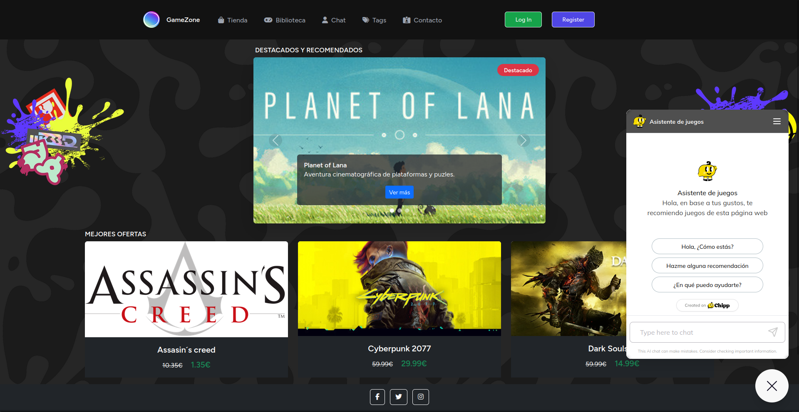
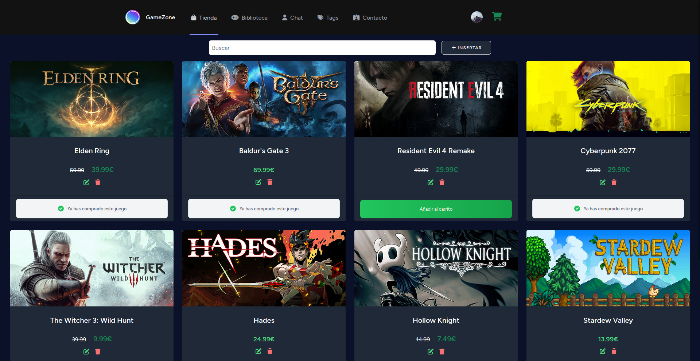
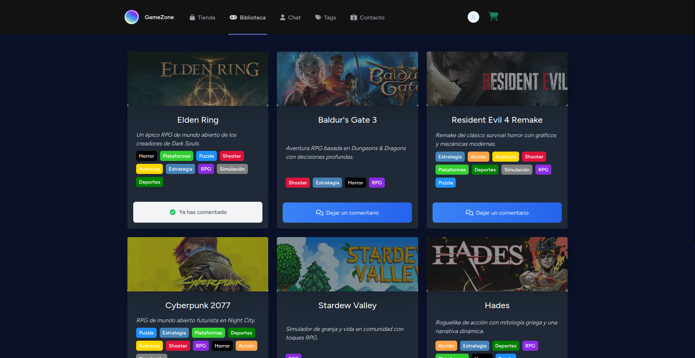
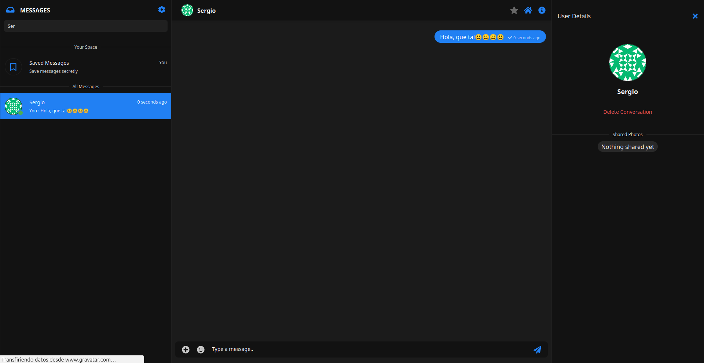
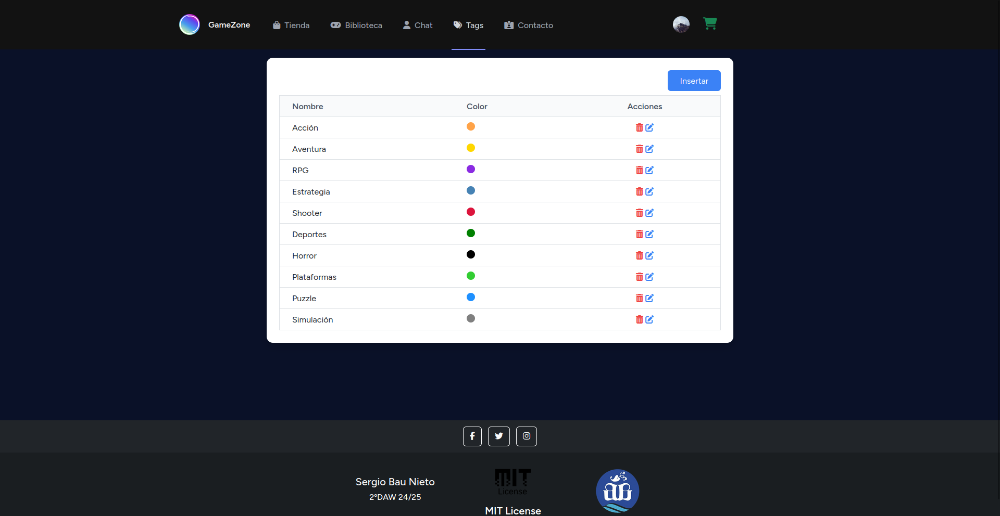
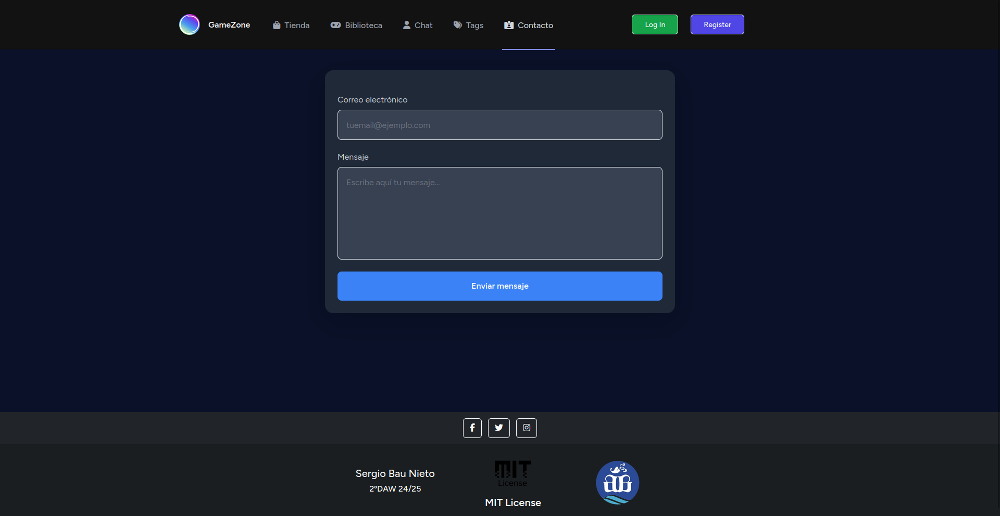
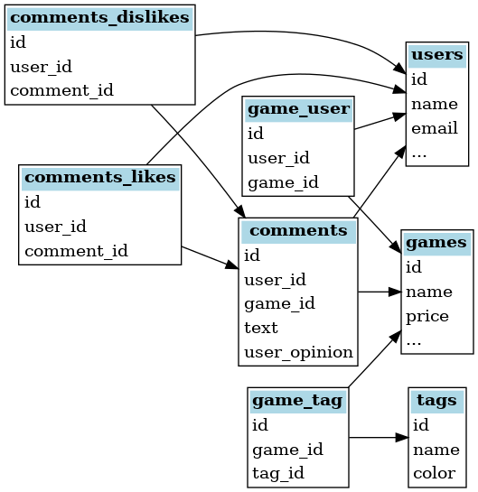

# 🎮 GameZone  







## 📖 Description
This website allows users to purchase games via Stripe, leave comments and likes/dislikes, chat with other users through Chatify, manage tags, and handle email communications via Mailtrap.

## 🌐 Technologies used  

- **Laravel 11 + Jetstream + Mailer** – User authentication and management.  
- **Blade templates** – Laravel’s template engine for building views.  
- **Tailwind CSS** – Utility-first CSS framework for responsive design.
- **Bootstrap 5** - CSS framework for responsive layouts and components.
- **Chipp** - AI integration on the homepage.
- **Stripe** - Payment gateway integration.
- **Chatify** - Real-time chat functionality.
- **Mailtrap** - Email testing and contact form handling.

## 💾 Database structure  



## 🚀 Instalation and configuration

### 1️⃣ Clone the repository  
```bash
git clone https://github.com/MSBYSergio/GameZone.git
cd GameZone
```

### 2️⃣ Installing dependencies
```bash
composer install
npm install
```

### 3️⃣ Configure environment variables
```bash
cp .env.example .env
php artisan key:generate
```

### 4️⃣ Execute migrations and seeders  
```bash
php artisan migrate:fresh --seed
```

### 5️⃣ Run the command to access the local server
```bash
php artisan serve
```
> This will start the development server at localhost:8000 by default.

## License
This project is licensed under the [MIT license](https://opensource.org/licenses/MIT).
